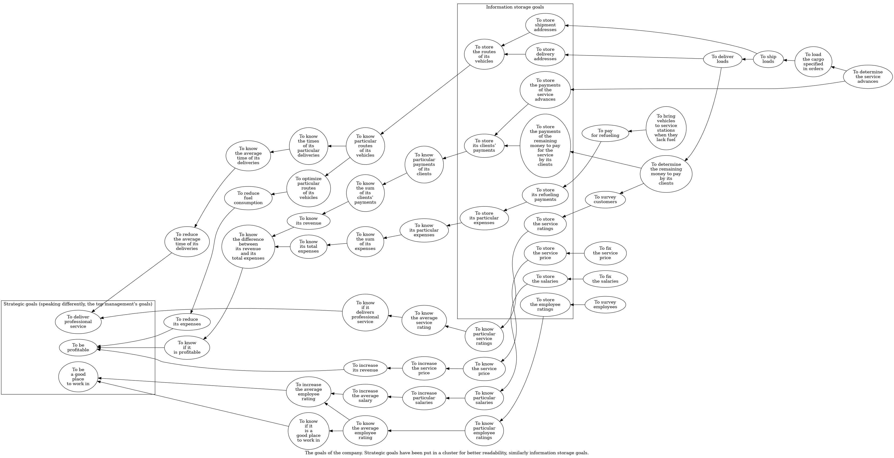

# Transport company

[ongoing-todos.txt](ongoing-todos.txt)

[ongoing-reads.txt](ongoing-reads.txt)

[completed-todos.txt](completed-todos.txt)

[completed-reads.txt](completed-reads.txt)

# Update 1

This is my first update in this "transport company" project. The project is a spin-off of my "SQL and PostgreSQL learning" project (also available on GitHub at https://github.com/decision-making-mike/sql-postgresql-learning). You can find more details about the spin-off itself there, in update 50.

The goals of this new project are to showcase and to develop my business analysis and databases skills. I hope that the separation of it will let me present the skills more clearly than if it still was a part of the "SQL and PostgreSQL learning" project.

This README shall serve as a blog, similarly to the README of the source project. But differently to there, here I decided not to emphasize this fact, thus not give the blog a separate URL address. For the record, the README is available either at https://github.com/decision-making-mike/transport-company/blob/main/README.md or https://github.com/decision-making-mike/transport-company.

In this initial commit I'm including two files that have been created in, and committed to the source project. They are `business/archive/stakeholders.odg` and `business/stakeholders.jpg`. Information about them, if any, can be found in the README of the source project. Markworthy I don't include yet any of the database-related files I have created so far. I'll do this in one of the next updates, when I'll make sure they are up-to-date.

I'm also including new files. They are `business/goals.dot` and the related `business/archive/goals-2025-02-13.dot.png`, `business/visualize-graphs.bash`, and `business/split-labels-contents.awk`.

`business/goals.dot` is the result of my thoughts about the model of the business of the company. It contains the goals of the company. You can think about it as a "goal model" of it. "How do you define a goal?", you can ask. I believe a good basis for the definition is the common, intuitive understanding of a business goal. This understanding is clearly visible in the case of "strategic goals", e.g. the goal "to be profitable". Then, the less strategic, and the more operational the goal is, the less it resembles a business goal, and the more a kind of "requirement".

I don't think the goal model is complete, but satisfies me enough to publish it. (I keep in mind that I'm rushed by the primary reason I am on GitHub whatsoever, that is, to get a job. The more agile I develop my portfolio, the better.)

The goal model is written in the DOT language, that is, in plain text. To make it better advertise the project, I should present it in a visual form. So I'm including the file `business/archive/goals-2025-02-13.dot.png`, and I've embedded in this README below. It is archived from the start, and has been given a date because it visualizes only the current state of the DOT file. The goal model, thus the DOT file, is going to be updated.

It can be seen that I visually grouped, thus emphasized two kinds of goals. One, "strategic goals", and two, "information storage" goals. The emphasis of the "strategic goals" should correspond to the fact they are the foundation for all the business models, as I've described in the README of the source project. The emphasis of the "information storage" goals should reflect the fact that the main goal of the project, as I currently see it, is to have created a database.

The `business/visualize-graphs.bash` script serves two purposes now, and I see two more uses of it in the future. One, it inserts newlines in appropriate places within the contents of the labels in said DOT file. This way I can write the contents without embedding the sequence `\n` by hand. I can then focus more on the semantics, and less on the presentation. Two, the script displays the PNG file. I am then freed from typing the command to display it. As for future uses of the script, it, three, could translate my custom "presentation statements", embedded within the contents of the labels in the DOT file. The reader can see them in the DOT file. They are now commented out as I'm not sure whether they serve any purpose. Four, the script could convert multiple DOT files at once. There is now only one, but I plan to include more.

Should it be worth noting, the script's extension is `bash`. I tend to give my scripts the `sh` extension, but now I thought to try something different. I think `bash` suits since the script is written in Bash, and additionally the shebang is `#!/bin/bash`. I don't know how many scripts out there have the `bash` extension. I may change it if I discover someday it doesn't have its uses.

The `business/split-labels-contents.awk` script performs the actual insertion of newlines that I've mentioned above. Remarkably, as far as I remember, it is my first AWK script of more than one line, if not the first ever. Specifically for that reason it may contain bugs. If the reader will find a bug, I'd be glad to be told about it in an issue.