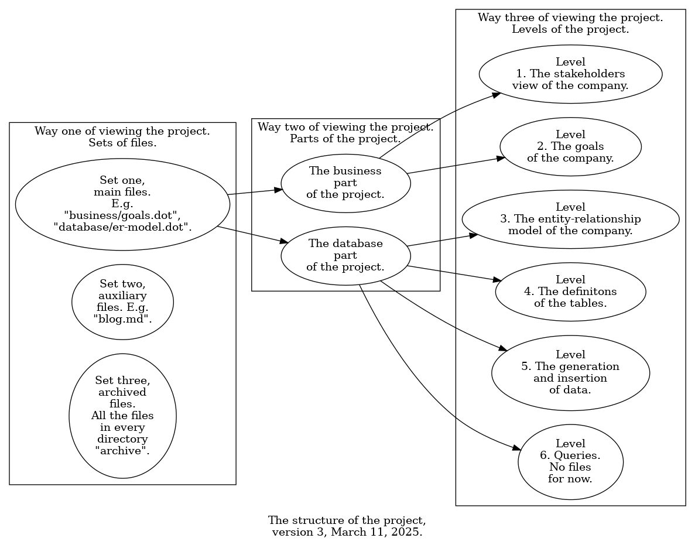

# Transport company.

This repository holds a project of an example transport company. By a "project" I mean a set of standards, overviews, rules, scripts, and the like, that are published here. One could think of the project as a theoretical basis for a transport company, in contrast to an implementation of it, which would be the actual company in the wild.

## Goals.

The main goal of this project is to support the showcase and development of my business analysis and database skills. In other words, the project is part of my portfolio.

## Audience.

The main audience of this project are recruiters. I have decided not to differentiate them by the level of technical expertise. What follows, it is my level of this expertise, rather than that of my audience, that dictates in what style I write blog updates, comments in scripts, et cetera.

## Contribution.

I don't know if this README and the project as a whole will be informative enough for you, visitor. But I don't specifically encourage you to make issues. I shouldn't expect you to tell me what I need to do in my portfolio, you could be not comfortable with it. Of course, if you'd like to make an issue, that's fine, I will read it and consider its applicability. You can note I haven't disabled issues in the repository settings.

## Structure of the project.



## Blog.

The project has a blog, in the file [`blog.md`](blog.md). There, one can read an extensive description of the changes as the development of the project continues.

## Usage of the scripts in the project.

### Requirements.

#### Package requirements.

The following packages need to be installed, and in the version given, before using the scripts. One can check whether a package is installed and in which version with

```
apt list --installed <package>
```

| Package. | Version.
| - | -
| `bash` | 5.0.
| `findutils` | 4.7.0.
| `graphviz` | 2.42.2.
| `gawk` | 5.0.1.
| `grep` | 3.4.
| `eog` | 3.36.3.
| `time` | 1.7.

#### `PATH` requirements.

The following commands need to be in `PATH` before using the scripts. In Bash, one can check if a command is in `PATH` with

```bash
type -P <command>
```

| Command.
| -
| `bash`
| `psql`
| `find`
| `xargs`
| `dot`
| `gawk`
| `awk`
| `grep`
| `eog`

#### Other requirements.

The following requirements need to be met before using the scripts.

| Requirement. | Example command to check it.
| - | -
| PostgreSQL 17.4 installed. | `psql -U postgres -c 'select version ();'`
| (An instance of?) PostgreSQL 17.4 running. | `pg_lsclusters`

### Usage.

| Task. | Command. | Directory that the command should be executed in, relative to the project's root directory. | Notes.
| - | - | - | -
| Creating the database, removing the old one if it exists, generating data, and inserting them. | `bash reset-database.bash [<port>] [<times log file>]` | `./database` | `<times log file>` means a file that is to be used for logging the times of data generation and insertion.
| Benchmarking data insertion and generation. | `bash benchmark-data-insertion.bash <times log file>` | `./database` | `<times log file>` means as above.
| Comparing benchmarking results before and after code optimization. | `gawk -f process-benchmarking-results.awk <times log file with times before the optimization> <times log file with times after the optimization>` | `./database` | `<times log file>` means as above.
| Verifying that the data has been generated and inserted correctly. | `bash show-sample-data.bash` | `./database`
| Getting the results of the queries. | `bash get-queries-results.bash` | `./database`
| Creating PNG files from DOT graphs across the whole project, and displaying the files. | `bash visualize-graphs.bash` | `./`

## Development of the project.

To view ongoing TODOs of this project, see the file [`ongoing-todos.txt`](ongoing-todos.txt).

To view completed TODOs of this project, see the file [`completed-todos.txt`](completed-todos.txt).

## Reads.

I inform what reads relevant to this project I am reading or have completed. By "reads" I mean articles, videos, and podcast episodes, among others. I inform what I currently read only if it is a long read. For short to medium-length reads, I inform about them only after completion.

Currently I am reading nothing.

To view my completed reads, see the file [`completed-reads.txt`](completed-reads.txt).

## Statistics.

To view some technology statistics of the project, see the file [`technology-statistics.txt`](technology-statistics.txt).
