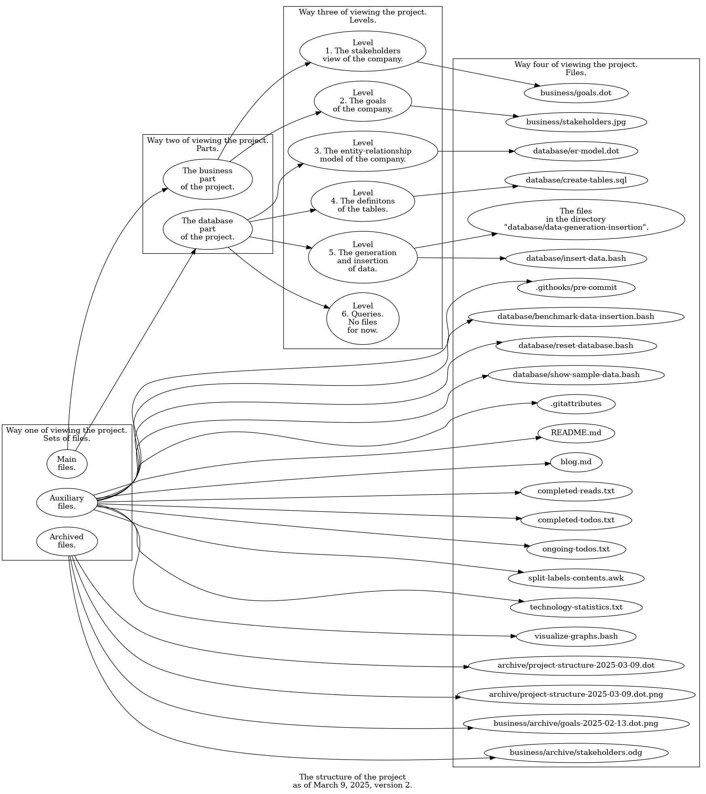
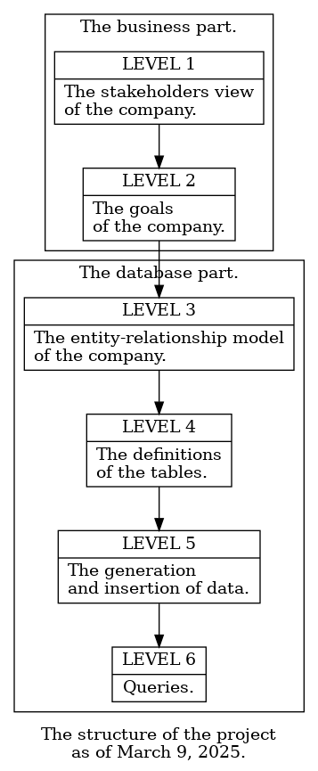

# Transport company

## Update 20. `split-labels-contents.awk` changes.

In this update I'm introducing two changes in the script `split-labels-contents.awk`. One, there are allowed now spaces around the equal sign in labels. The reason for the change is, spaces there improve readability. Two, the script produces now strings `\n` instead of actual newline characters. The reason for the change is, `dot` for some, unknown to me reason treats actual newlines as if they don't exist if the shape of the node is `record`. This means in the diagram there are no newlines where they should be, which means, words are concatenated without any separator.

## Update 19. First query. Changes in the goals.

Having prepared a benchmark (see update 14), a natural follow-up would be to try to optimize the code. But I have decided to go back to answering business questions, those listed far back in update "2024-11-22" of the project "SQL and PostgreSQL learning".

Let me now present the questions once again, but phrase them a bit differently. First, are we profitable? Second, how are we profitable? Third, do we deliver professional service? Fourth, how do we deliver professional service? Fifth, are we a good place to work in? Sixth, how do we are a good place to work in?

In this update I'm answering the first question. I've created the script `database/get-queries-results.bash` and its helper script `database/get-queries-results.sql`. To see all the changes I've made, see the commit. To get the answer for the question, and for any question I shall answer in the future, we go to the directory `database` and execute

```
bash get-queries-results.bash
```

Now, the changes in the goals.

One, I've added departments. More information is in the TODO "Addition of departments to the goals of the company", in `completed-todos.txt`.

Two, I've switched the direction of edges. I believe that having `business/goals.dot` formatted this way should let me more easily make changes in them.

Three, I've made I've noted that the strategic goals are the clostest what can be regarded as an implementation of level 1. Likewise, I've marked out those information storage goals that are to be implemented on level 3. Now the interdependence between levels should be more prominent.

## Update 18. An update to the structure of the project.

In the preceding update I have described the structure of the project. But now I see it as incomplete. So, in this update I'd like to update it.

On the one hand, in the README I say that "[o]ne could think of the project as a theoretical basis for a transport company". The structure that I have described is aligned with this statement. It represents all those "standards, overviews, rules, scripts, and the like" of the company, to also quote the README.

On the other hand, there are files that are not included in this definition of the project and in the structure. These are the files in the directory `business/archive`, the file `blog.md`, and other. They are only indirectly related to the company, and don't fall into any level of the project I've listed in the preceding update.

What to do with those files? I've decided to add a fourth way of viewing the project, in addition to the three mentioned in the preceding update. This new way divides the project into three sets of files.

Set one contains "main files", as we shall call them. These are all the files that are directly related to the development of the company, and that are described as part of the structure of the project in the preceding update. An exception is `database/benchmark-data-insertion.bash`. This file shall be treated as an auxiliary one even though I have mentioned it in the preceding update. Without these files the project wouldn't exist.

Set two contains "auxiliary files", as we shall call them. These include all the files in the main directory of the repository, for example `blog.md`, and the files `database/reset-database.bash`, `database/benchmark-data-insertion.bash` and `database/show-sample-data.bash`. Without them the project would exist, but would be little to much nonfunctional.

Set three contains archived files. These include the files in any directory `archive` throughout the project. I'm putting them into a separate category just because they don't seem to fit into the other two.

Below I'm posting the second version of the diagram from the preceding update.



By the way, on the diagram I can notice that the script for splitting the labels into lines moved the numbers of the levels to the next lines. I find that presenting numbers in such a way hinders readbility. I've prepared a TODO to change that.

## Update 17. The structure of the project. Two ways of developing the company.

In this update I'm presenting a more elaborate description of the structure of the project than that the reader could see in the README up to now. Later, I'm discussing two ways of developing the company. I thought both these things could help me not to get lost in the project.

First the structure. One can view the project in three ways. One, the project is a set of files. Two, the project is a set of two parts, the business part and the database part. Three, the project is a set of levels. Below I'm describing how those three interrelate. A note, I treat the files in the directory `business/archive` as not related to any level.

Level one, the stakeholders view of the company. I have chosen it to be the topmost level because the second level, the goals of the company, originated from it in a way. The stakeholders view belongs to the business part. Related files include `business/stakeholders.jpg`.

Level two, the goals of the company. In a way, they have originated from the stakeholders view, and for this reason I treat them as the second level. They belong to the business part. Related files include `business/goals.dot`.

Level three, the entity-relationship model of the company. It is to be implemented according to the goals of the company, thus makes the third level. It belongs to the database part. Related files include `database/er-model.dot`.

Level four, the definitions of the tables. The definitions are to be implemented according to the entity-relationship diagram, thus makes the fourth level. They belong to the database part. Related files include `database/create-tables.sql`.

Level five, the generation and insertion of data. Data can only be generated for and inserted to the tables that have been created. Therefore, the generation and insertion make the fifth level. They belong to the database part. Related files include files in the directory `database/data-generation-insertion`, and the files `database/insert-data.bash` and `database/benchmark-data-insertion.bash`.

Level six, the queries. There are none yet. Their purpose is to answer the questions presented as the goals of the company, and earlier yet in the project "SQL and PostgreSQL learning", in update "2024-11-22". The queries belong to the database part.

To better visualize what it all looks like, I'm posting below also its graphical version. I don't show the files for the diagram to be more readable.



Second, the two ways of developing the company.

In way one, I implement a new feature through all the levels from the goals to the queries. Let us omit the first level, the stakeholders view, because it is too general to be of much use here. It can be only a guide for how the company should look like, or rather, what should I take into account first when creating the company.

Let us have an example of this way. Say I wanted to make the company pay taxes. I would first need to prepare some new, tax-related goals, maybe make changes to the existing goals. Then there should go changes in the entity-relationship model, then in the definitions of the tables, then in the generation and insertion of data, and finally in the queries.

As for benefits, this way always gets the job done for a single feature. Once I've decided that a feature is to be implemented, I will either implement it through all the levels, or abandon and roll back any changes I've made so far.

As for drawbacks, this way requires constant context switching. Also, it's difficult because different features maps differently between levels. For example, one goal may map to multiple entities, or the other way around, one entity may map to multiple goals.

In way two, I implement multiple new features on a given level one after another, not caring about their implementation on the levels below. Of course, the level above that level has to have implemented each of the features, as the level below must be in accordance with it.

For an example, let's say I wanted the company to pay taxes and buy properties. Both of these features I could first implement as goals. Only if, say, I felt I had the time and energy, I would decide to implement them on other levels.

As for benefits, this way allows less stringent context switching. In turn, I can focus my attention on the inner coherence of a level.

As for drawbacks, this way favors partial implementation of features. It means the company might have goals, but no ER model entities for them, or ER model entities, but no tables for them, et cetera.

## Update 16. A repository cleanup.

I thought that the repository could use a small cleanup.

One, I've moved all the blog content from the file `README.md` to a separate file, `blog.md`. Then, I've prepared a "README proper", which I think is a usually expected kind of README, an entry point to the project, an overview thereof. I hope that this change will bring more professionalism to the project, specifically in the eyes of casual visitors.

Two, I've removed the file `ongoing-reads.md` and made a section in the README for one ongoing read. I've observed it makes no sense for me to read multiple things for one project in the same time. Therefore, it doesn't make sense to keep a file, which name and purpose of suggest I am going to read multiple things. Just to note, I'm right now reading multiple reads, but for different projects, namely the PostgreSQL's documentation for the project "SQL and PostgreSQL learning", and a computer networks book for the project "computer networks learning".

Three, not related to the repository, I'm thinking about changing the structure of a TODO. Currently, each one looks as if taken out of context. Also, I don't really feel like creating TODOs. An improvement could mitigate this dislike a bit. So, in future TODOs I plan to include the date of creation and a longer description.

## Update 15. The syntax of the project.

In this update I'm publishing how the project would be to be used if the scripts were to be run. This is both a reminder to my future self and a showcase for recruiters.

It could be a possible enhancement for the project to add a script facilitating automatic checking of all the requirements. Such a script could even install lacking software. But I currently don't think this is what I should spend my time and energy for.

Important note. The requirements and syntax below describe the current state of the project. It means that both may change in the future, and most probably will.

### Requirements for using the syntax.

#### Package requirements.

The following packages need to be installed, and in the version given. It can be checked with

```
apt list --installed <package>
```

| Package. | Version.
| - | -
| `bash` | 5.0.
| `findutils` | 4.7.0.
| `graphviz` | 2.42.2.
| `gawk` | 5.0.1.
| `grep` | 3.4.
| `eog` | 3.36.3.
| `time` | 1.7.

#### `PATH` requirements.

The following commands need to be in `PATH`. It can be checked in Bash with

```bash
type -P <command>
```

| Command.
| -
| `bash`
| `psql`
| `find`
| `xargs`
| `dot`
| `gawk`
| `awk`
| `grep`
| `eog`

#### Other requirements.

| Requirement. | Example command to check it.
| - | -
| PostgreSQL 17.4 installed. | `psql -U postgres -c 'select version ();'`
| (An instance of?) PostgreSQL 17.4 running. | `pg_lsclusters`

### Syntax.

| Task. | Command. | Directory that the command should be executed in, relative to the project's root directory. | Notes
| - | - | - | -
| Creating the database, removing the old one if it exists, generating data, and inserting them. | `bash reset-database.bash [<port>] [<times log file>]` | `./database` | `<times log file>` means a file that is to be used for logging the times of data generation and insertion.
| Benchmarking data insertion and generation. | `./bash benchmark-data-insertion.bash <times log file>` | `./database` | `<times log file>` means as above.
| Verifying that the data has been generated and inserted correctly. | `bash show-sample-data.bash` | `./database`
| Creating PNG files from DOT graphs across the whole project, and displaying the files. | `bash visualize-graphs.bash` | `./`

## Update 14. The performance of the generation and insertion of data.

I have indicated in update 6, and it still seems to me, that the data generation and insertion could take less time. To optimally optimize those operations, first I need to benchmark them.

Now, I feel that before benchmarking, I could read more about it, not only in PostgreSQL, but in general. I've saved some to-reads, yet I don't plan to do it right now. Reading and understanding these things would be going to take time. I had better have something done before I run out of my motivation for making my portfolio.

Let us start gently. We consider first what does it mean for the generation and insertion of data to take less time. Those operations are in their entirety done by means of the script `database/insert-data.sql`. There is no other command in this script. So, those operations' taking less time means that the execution of this script takes less time.

So, a simple benchmark could be to execute the script several times, measure the times each time, and calculate the averages. In principle, we could then make some changes to the commands and run the benchmark again to compare. But how do we know what parts of the script we need to change?

We conclude we need a more granular benchmark. Let's consider the architecture of the script. It consists of several commands `do`, each of them being responsible for generating and inserting data for one table. Worth to note, every new table I should introduce in the database in the future is going to likewise have one command `do` for data generation and insertion.

The first solution we see is to measure the times of particular commands. And we conclude we need no more solutions, that is, no more granular benchmarking. The commands are simple enough for more granularity not about to bring better insight. An advantage of stopping here is, every future table can be benchmarked the same way.

But such a benchmark includes an implicit assumption that for every command, either every execution of it should take the same amount of time, or the differences should be neglectable. Neither of these options we shall regard as true if we consider that some commands generate random data.

To understand it, let's say I've made changes to such a command. I believe that they improve its performance. But when I'm benchmarking the command afterwards, I see that it sometimes takes more time to execute it, sometimes less. What follows, I cannot know whether its performance has increased. And this variability is due to the fact that sometimes this command generates more data, sometimes less.

In reality I observe that the differences between execution times of the whole script can be tens of seconds. In conclusion, we shall somehow normalize the average execution times of particular commands, so that for every command they be comparable.

For the record, let's put aside how predictable or unpredictable the performance of processing the script by the database, the operating system and the hardware could be. I'm not confident enough to discuss it.

Let the main factor in the performance of a command be the number of rows inserted. I have not measured it, but for simplicity let's assume it is the case. Should the future prove me wrong, I'll reconsider this assumption. This way, I'm going to do the normalization by dividing the execution time of a command by this number.

I have evaluated the number of rows inserted for every command. The reader can find them in the table below. To simplify the descriptions, I'm identifying particular commands with the entities that are represented by the rows those commands insert.

| Entity | How many there are to be inserted
| - | -
| Order | $1000$
| Vehicle | $10000$
| Parameter | $2$
| Parcel | $1000 \cdot ceiling (random (1, 1000) \div random (5, 50))$
| Shipment | $1000$
| Delivery | $1000$
| Made payment | $2000$

It can be seen that the number of rows is random only in the case of the command where the rows represent parcels. I might then normalize the execution times for this command only, as we don't plan to compare the average times of different commands. But for consistency I'll do that for every command.

I'm not going to keep the reader in suspense whether all of what I have just said is reasonable and will give expected results. Together with the above considerations, in this update I'm publishing appropriate changes in the scripts. I'm including the results of benchmarking, too. A general description of the changes follows.

I could think of three ways for getting the execution times. One, I would create an additional table, make the times be calculated in the PL/pgSQL code, and save them in this table. Two, instead of using a table, I would save the times to a file. Three, I would change the scripts `database/insert-data.sql` and `database/reset-database.bash` so that each of the commands be executed by a separate command `psql`. I would then measure the times in Bash instead of PL/pgSQL. This last way is in contrast to the current situation when the whole script is executed by one command `psql`.

I have chosen the last way. Possibly because it felt not right to me to mix benchmarking with business in the database. In `reset-database.bash`, I have added the requirement to provide a log file as a parameter. I have made this script execute commands from the new script `insert-data.bash`, and I have removed the old script `insert-data.sql`.

In `insert-data.bash`, I have put invocations of the program `/bin/time`. I'm mentioning this change because I'm not used to put full paths of programs in my scripts. Let me here explain the reason to my future self. Bash would interpret a lone `time` as a reserved word, and process it accordingly. As much as this processing is close to what the command `/bin/time` does, Bash apparently won't let me easily redirect the captured time to a file. Well, it of course may be that I just don't know an easy way. Anyway, not having it redirected would result in its going together will all other output. So, I would need to filter out this all other output. This seemed clunky to me.

I have moved particular commands `do` to individual files, and put those files in the directory `data-generation-insertion`.

I've created the script `benchmark-data-insertion.bash`, and its helper script `process-benchmarking-results.awk`. One unfortunate thing is that I have tight-coupled them, by using the "names of times" given the Bash script in the AWK script. These are "orders_generation_and_insertion_time_in_seconds" and so on. In case I change them, I will need to change them in both files. Another unfortunate thing is that in the Bash script I repeat for every command nearly the whole code for measuring the time of a command. Instead, it could be done using a loop. In the future I'm going to think about changing these things.

On a final note, I could write here how to actually perform the benchmarking. But let me leave it to the upcoming update 15.

## Update 13. Made payments.

In this update I'm updating the script `database/create-tables.sql` with the creation of the table `made_payments`, the script `database/insert-data.sql` with the generation and insertion of data for that table, and the script `database/show-sample-data.bash` with the showing of the data in that table.

It is worth to note that as the table `made_payments` can be created and filled with data, I could say the project has achieved a certain threshold of completeness. Now all the tables mentioned in the current version of ER model can be created and filled with data. Also, the data in all of them can be verified by means of the script `database/show-sample-data.bash`. There seems to be the right time now to move to the task of increasing the performance of data preparation and insertion.

## Update 12. Deliveries.

In this update I'm updating the script `database/create-tables.sql` with the creation of the table `deliveries`, the script `database/insert-data.sql` with the generation and insertion of data for that table, and the script `database/show-sample-data.bash` with the showing of the data in that table.

## Update 11. Shipments.

In this update I'm updating the script `database/create-tables.sql` with the creation of the table `shipments`, the script `database/insert-data.sql` with the generation and insertion of data for that table, and the script `database/show-sample-data.bash` with the showing of the data in that table.

## Update 10. Experimental introduction of automatic technology statistics of the repository.

In this update I'm experimentally introducing automatic technology statistics of the repository. They are included in the file `technology-statistics.txt`. The reader can access the file directly in the repository, as well as through a link at the beginning of this README.

Currently the statistics consists only of a list of numbers of files in the repository whose names contain particular extensions. I may consider enhancing them in the future.

The statistics are automatic because they are generated automatically by Git's hook `pre-commit`. Now, it wasn't obvious how to let the reader see the hook. By default it should reside in the file `pre-commit`, in the directory `.git/hooks`. As I observe, Git doesn't let me `git add` this file when it's in that directory. I have resolved to move the file to the directory `.githooks`. I then did `git config --local core.hooksPath .githooks/`, as suggested by bbarker in [this Stackoverflow answer](https://stackoverflow.com/a/54281447/27799074). The only inconvenience is that now, after the repository is cloned, one needs to likewise change `core.hooksPath` for the new repository.

As the reader can see in the hook, I have ensured that the statistics include any new files which are part of the current commit, that is, that one that the hook is run before.

The introduction is experimental because I am yet to see how I like the statistics. Also, during the development of the project there may show up some edge cases I'm currently not aware of that will prevent the statistics to be properly generated, hence to be useful.

## Update 9. Parcels.

In this update I'm updating the script `database/create-tables.sql` with the creation of the table `parcels`, the script `database/insert-data.sql` with the generation and insertion of data for that table, and the script `database/show-sample-data.bash` with the showing of the data in that table.

Moreover, I'm fixing a bug in the insertion of data into the table `parameters`. I used the character double quote `"` instead of the character single quote `'`. By that, instead of defining string constants, what I desired, I defined delimited identifiers. As a result, as far as I understand it, PostgreSQL was interpreting the identifiers as column names, and was inserting the same values into the column `name` that it was inserting into the column `value`. That in turn was causing that I was getting `null` when making a `select` on that table when inserting data into the table `parcels`.

Moreover, I'm decreasing the number of orders to generate from 10 thousand to 1 thousand. This is for the generation and insertion of parcels to take reasonable time, as 1 order may generate up to $1000 / 5 = 200$ parcels.

## Update 8. Parameters.

In this update I'm updating the script `database/create-tables.sql` with the creation of the table `parameters`, the script `database/insert-data.sql` with the generation and insertion of data for that table, and the script `database/show-sample-data.bash` with the showing of the data in that table (should it be "the showing", not "showing"?).

## Update 7. Vehicles. The script `database/show-sample-data.bash`.

In this update I'm updating the script `database/create-tables.sql` with the creation of the table `vehicles`, and the script `database/insert-data.sql` with the generation and insertion of data for that table.

Additionally, I'm publishing the script `database/show-sample-data.bash`. It facilitates validating that tables contain expected data.

## Update 6. The scripts `database/create-tables.sql` and `database/insert-data.sql`.

In this update I'm publishing the scripts `database/create-tables.sql` and `database/insert-data.sql`. They are simplified versions of the scripts with the same names that I have created back when this project still was a subproject.

The script `database/insert-data.sql` is worth a word. Currently, on my machine, it generates and inserts 10 thousand rows into a 1-column table in about 0.55 s. For 100 thousand rows the time grows to 4 s, and for the desired 1 million rows to 40 s. Given I expect to perform the generation and insertion multiple times during debugging, I have fallen back to 10 thousand rows for now. My conclusion is, these times are not acceptable, especially given there will be more tables than this one to prepare and insert data into. I'm going to look for optimization.

## Update 5. The entity-relationship model of the company.

In this update I'm publishing the entity-relationship model of the company. On a side note, I now think that it should have been published before the `database/reset-database.bash` script. This model doesn't expect the database to exist, while the `database/reset-database.bash` script is a helper script for creating the database.

[The article about "entity-relationship model" on Wikipedia](https://en.m.wikipedia.org/wiki/Entity%E2%80%93relationship_model) lists 3 levels of such models, namely conceptual, logical and physical. I'm not familiar with data modeling, and this model is simple, so I've decided to not categorize it anyhow, and just name it an "entity-relationship model". If I had to categorize, I'd say it's a logical ER model that doesn't want to abandon the simplicity of a conceptual ER model. Should I need to create additional ER models in the future, I shall distinguish them by their names from this one. I don't know if I will change then the name of this model, though.

The model is a simplified version of the model that was represented by the `create table` statements I've published back when this project still was a subproject. You can review them at https://github.com/decision-making-mike/sql-postgresql-learning/blob/main/archive/transport-company/database/create-tables.sql. Only as soon as the need arises, I'm going to make it more sophisticated. By the by, I like how simple it currently looks.

## Update 4. The `database/reset-database.bash` script.

In this update I'm starting to publish files related to the database. The file `database/reset-database.bash` will be the first.

This script I've created back when this project still was a subproject. You can see the previous version at https://github.com/decision-making-mike/sql-postgresql-learning/blob/main/archive/transport-company/database/reset-database.sh. I'm going to discuss all the changes one by one.

One, I've changed the extension of the file from `sh` to `bash`. This is consistent with the practice I introduced in update 1.

Two, I've changed the `#!/usr/bin/bash` shebang to `#!/bin/bash`. First, I don't know if there is any difference between them from the point of view of an average Linux distribution. Here I mean only a theoretical difference as I don't assume the script to be run by anyone other than me. Also, I don't make my GitHub scripts executable, so, at least I guess so, there is no need for the shebang anyway if I'm about to run the script.

Second, there is a difference between them from my point of view. `/bin/bash` is shorter and more ituitive for me, thus easier to conceptualize, remember and type. As a side note, this difference has led me to plan to use this shorter shebang in all the scripts in my GitHub projects from now on (at least to the extent I'm going to remember this decision in case of any future GitHub projects). If anyone has any insights on which shebang could I prefer to use, please make an issue, I'd be glad to know.

Three, I've put single quotes (`'`) around more strings, the main ones being the file names `create-tables.sql` and `insert-data.sql`. Now the script is consistent with my belief that it is a good practice to use single quotes in Bash wherever it doesn't do any harm to the code. For instance, theoretically one could place command names inside single quotes, but I am not sure if this wouldn't harm readability of the code. I am open to consideration here.

Four, I've lowercased all the variable names. In that I am consistent with my current practice of making lowercase the names of all the variables I create (but I don't exclude a possibility that there is a language out there not allowing creation of lowercase variable names). As the main benefit of the practice I find no need to decide on a script-by-script basis. This saves energy both for the lack of decision, and for not keeping in mind why I have made some names lowercase, and some uppercase.

Five, in case of the `echo` commands, I've moved the redirections `1>&2` right after the names of the commands. I think the redirections are now more evident. But I am open to consideration where they should go in a command in the general case.

Six, I'm now checking for the error of the last command in the same pipeline. That is, instead of using `$?`, and doing

```bash
<some command>

if [[ $? != 0 ]]
then
    echo "Database creation error" 1>&2
    exit 1
fi
```

as it was before, now I use `||`, and do

```bash
<some command> || {
    echo 1>&2 "Error when dropping or creating the database, exiting"
    exit 1
}
```

effectively having gotten rid of using the `$?` variable in the script. I now think this was unnecessary. But as reverting the change could be only done manually now, that is, with no help of Git, I'm not going to change it.

Seven, I've introduced the `time` command. This command will let us compare the times of data preparation (and incidentally of insertion, since they are to be bundled). I guess the time of data preparation is worth to keep an eye on for three complementing reasons. First, I assume `reset-database.bash` to run as quick as not to dishearten the person that has run it, given a machine performing similarly to mine. Second, I plan that the script load all the data I plan for the database to hold. Third, I aim for 1 million rows at least in some of the tables. I say "at least in some" because the number of rows in some tables might depend on other tables. I haven't analyzed it yet. Lastly, worth to mention that in case the times won't be satisfying, I don't plan to do any aggresive optimization. This would use my energy for things I don't feel I need. I'd rather lower either the bar of performance, or of numbers of rows, and keep the whole project move on.

## Update 3. Graph visualization update.

Firstly, I've moved the `visualize-graphs.bash` and its corresponding `split-labels-contents.awk` scripts from the `business` directory to the main directory of the repository. The reason was to have their location reflect that now they are to visualize DOT graphs in the whole repository instead of only in the `business` directory. Although currently any DOT graphs are only in the `business` directory, I plan to have more of them elsewhere, too.

Secondly, in the `visualize-graphs.bash` script, I've removed the "main" `sed` command and the corresponding `sed_commands` variable. The reason was there was no DOT graph with labels that the commands could be use on. Also, the script is now simpler. However, I haven't removed the comments within the `business/goals.dot` file that are relevant to the `sed` commands, that is, `// [label="responsibility=top management"]`, and the like. I still believe that the information about "responsibilities" that they contain may have its uses in the future, when the graph will grow.

Thirdly, also in the `visualize-graphs.bash` script, I've removed the command `eog --fullscreen ./` and added a pipeline utilizing `find`, `grep`, `xargs` and `eog`. The reason was to allow displaying the generated images in the whole repository, that is, recursively, instead of just in the main directory of it. One may note I use the `--print0`, `--null-data`, and `--null` options. The reason is that the pipeline run in more cases without errors related to unusual file names than it would without those options.

## Update 2. Update of the goals of the company.

I've updated the goals of the company. First, I've added information about hiring employees. Then, I've restructured and updated goals related to storing shipments and deliveries. Here, notably, I've introduced the notion of the route of a parcel. Before the introduction only vehicles could have routes. Lastly, I've removed the notion of addresses, and clarified the formulation of some goals.

# Update 1

This is my first update in this "transport company" project. The project is a spin-off of my "SQL and PostgreSQL learning" project (also available on GitHub at https://github.com/decision-making-mike/sql-postgresql-learning). You can find more details about the spin-off itself there, in update 50.

The goals of this new project are to showcase and to develop my business analysis and databases skills. I hope that the separation of it will let me present the skills more clearly than if it still was a part of the "SQL and PostgreSQL learning" project.

This README shall serve as a blog, similarly to the README of the source project. But differently to there, here I decided not to emphasize this fact, thus not give the blog a separate URL address. For the record, the README is available either at https://github.com/decision-making-mike/transport-company/blob/main/README.md or https://github.com/decision-making-mike/transport-company.

In this initial commit I'm including two files that have been created in, and committed to the source project. They are `business/archive/stakeholders.odg` and `business/stakeholders.jpg`. Information about them, if any, can be found in the README of the source project. Markworthy I don't include yet any of the database-related files I have created so far. I'll do this in one of the next updates, when I'll make sure they are up-to-date.

I'm also including new files. They are `business/goals.dot` and the related `business/archive/goals-2025-02-13.dot.png`, `business/visualize-graphs.bash`, and `business/split-labels-contents.awk`.

`business/goals.dot` is the result of my thoughts about the model of the business of the company. It contains the goals of the company. You can think about it as a "goal model" of it. "How do you define a goal?", you can ask. I believe a good basis for the definition is the common, intuitive understanding of a business goal. This understanding is clearly visible in the case of "strategic goals", e.g. the goal "to be profitable". Then, the less strategic, and the more operational the goal is, the less it resembles a business goal, and the more a kind of "requirement".

I don't think the goal model is complete, but satisfies me enough to publish it. (I keep in mind that I'm rushed by the primary reason I am on GitHub whatsoever, that is, to get a job. The more agile I develop my portfolio, the better.)

The goal model is written in the DOT language, that is, in plain text. To make it better advertise the project, I should present it in a visual form. So I'm including the file `business/archive/goals-2025-02-13.dot.png`, and I've embedded in this README below. It is archived from the start, and has been given a date because it visualizes only the current state of the DOT file. The goal model, thus the DOT file, is going to be updated.


It can be seen that I visually grouped, thus emphasized two kinds of goals. One, "strategic goals", and two, "information storage" goals. The emphasis of the "strategic goals" should correspond to the fact they are the foundation for all the business models, as I've described in the README of the source project. The emphasis of the "information storage" goals should reflect the fact that the main goal of the project, as I currently see it, is to have created a database.

The `business/visualize-graphs.bash` script serves two purposes now, and I see two more uses of it in the future. One, it inserts newlines in appropriate places within the contents of the labels in said DOT file. This way I can write the contents without embedding the sequence `\n` by hand. I can then focus more on the semantics, and less on the presentation. Two, the script displays the PNG file. I am then freed from typing the command to display it. As for future uses of the script, it, three, could translate my custom "presentation statements", embedded within the contents of the labels in the DOT file. The reader can see them in the DOT file. They are now commented out as I'm not sure whether they serve any purpose. Four, the script could convert multiple DOT files at once. There is now only one, but I plan to include more.

Should it be worth noting, the script's extension is `bash`. I tend to give my scripts the `sh` extension, but now I thought to try something different. I think `bash` suits since the script is written in Bash, and additionally the shebang is `#!/bin/bash`. I don't know how many scripts out there have the `bash` extension. I may change it if I discover someday it doesn't have its uses.

The `business/split-labels-contents.awk` script performs the actual insertion of newlines that I've mentioned above. Remarkably, as far as I remember, it is my first AWK script of more than one line, if not the first ever. Specifically for that reason it may contain bugs. If the reader will find a bug, I'd be glad to be told about it in an issue.
